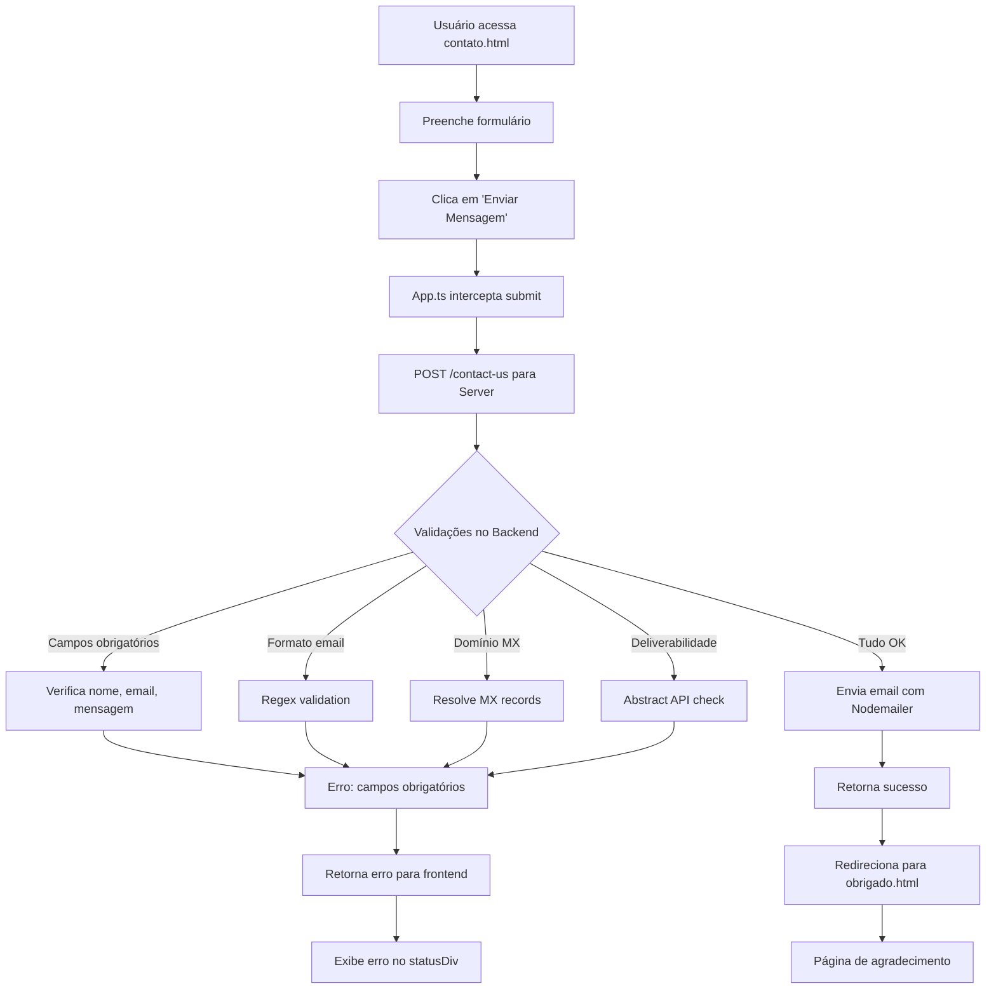

# OlluaS-code.github.io

Este é o repositório do portfólio pessoal de **Saullo**, um desenvolvedor Back-End especializado em Node.js. O projeto consiste em um site estático hospedado no GitHub Pages, acompanhado de uma API backend para processamento de formulários de contato.

## 📋 Descrição do Projeto

O portfólio apresenta:

- **Página Inicial**: Introdução e destaques de projetos
- **Sobre**: Biografia, habilidades e experiência
- **Projetos**: Lista de projetos desenvolvidos com links para repositórios
- **Contato**: Formulário para envio de mensagens com validação de email
- **Página de Agradecimento**: Confirmação de envio bem-sucedido

O backend fornece uma API REST que valida emails através de múltiplas camadas (formato, registros MX, verificação de deliverabilidade) e envia notificações por email.

## 🛠️ Tecnologias Utilizadas

### Frontend (Client)

- **HTML5** e **CSS3** semânticos
- **TypeScript** para interatividade
- **Vite** como bundler e dev server
- **Axios** para requisições HTTP
- **Bootstrap** e **Remixicon** para componentes e ícones
- **Glassmorphism** design com CSS moderno

### Backend (Server)

- **Node.js** com **Express.js**
- **TypeScript** para tipagem
- **Nodemailer** para envio de emails
- **Multer** para upload de arquivos
- **Axios** para integrações externas
- **Abstract Email Validation API** para verificação de emails
- **DNS resolution** para validação de domínios MX

## 🚀 Como Executar

### Pré-requisitos

- Node.js (versão 18 ou superior)
- npm ou yarn
- Conta de email SMTP (ex: Gmail) para envio de notificações

### Instalação e Execução

1. **Clone o repositório:**

   ```bash
   git clone https://github.com/OlluaS-code/OlluaS-code.github.io.git
   cd OlluaS-code.github.io
   ```

2. **Configure o Backend:**

   ```bash
   cd Server
   npm install
   cp .env.example .env  # Configure as variáveis de ambiente
   npm run dev
   ```

3. **Configure o Frontend:**

   ```bash
   cd ../Client
   npm install
   # Edite o .env com a URL da API (ex: VITE_API_URL=http://localhost:3000)
   npm run dev
   ```

4. **Build para Produção:**
   ```bash
   cd Client
   npm run build
   npm run deploy  # Para GitHub Pages
   ```

### Variáveis de Ambiente (.env)

Para o backend, crie um arquivo `.env` na pasta `Server/` com:

```env
PORT=3000
EMAIL_USER=seuemail@gmail.com
EMAIL_PASS=suasenhaapp
EMAIL_HOST=smtp.gmail.com
EMAIL_PORT=587
EMAIL_SECURE=false
ABSTRACT_API_KEY=sua-chave-api
ABSTRACT_API_URL=https://emailvalidation.abstractapi.com/v1/
```

Para o frontend, crie um arquivo `.env` na pasta `Client/` com:

```env
VITE_API_URL=http://localhost:3000
```

## 📊 Fluxo da Aplicação



## 📁 Estrutura do Projeto

```
├── Client/                 # Frontend
│   ├── src/
│   │   └── App.ts         # Lógica do formulário
│   ├── *.html             # Páginas estáticas
│   ├── style.css          # Estilos globais
│   ├── vite.config.ts     # Configuração Vite
│   └── package.json
├── Server/                 # Backend
│   ├── src/
│   │   ├── server.ts      # Servidor Express
│   │   ├── Email/         # Serviços de email
│   │   └── settings/      # Configurações
│   └── package.json
└── README.md
```

## 🔧 Scripts Disponíveis

### Client

- `npm run dev` - Inicia servidor de desenvolvimento
- `npm run build` - Build para produção
- `npm run deploy` - Deploy para GitHub Pages

### Server

- `npm run dev` - Inicia servidor com ts-node-dev
- `npm run build` - Compila TypeScript
- `npm run start` - Executa build em produção

## 🌐 Deploy

O frontend é automaticamente implantado no GitHub Pages através do workflow de CI/CD. O backend pode ser hospedado em serviços como Heroku, Railway ou Vercel.

## 📞 Contato

Saullo - [GitHub](https://github.com/OlluaS-code) - [LinkedIn](https://linkedin.com/in/olluas-code/) - [WhatsApp](contato.html#qrcode-section)

---

⭐ Se este projeto te ajudou, dê uma estrela!
